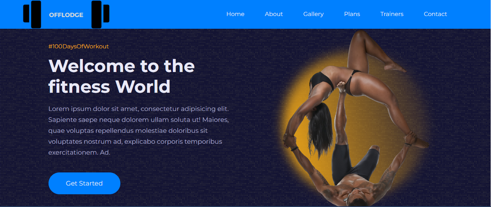
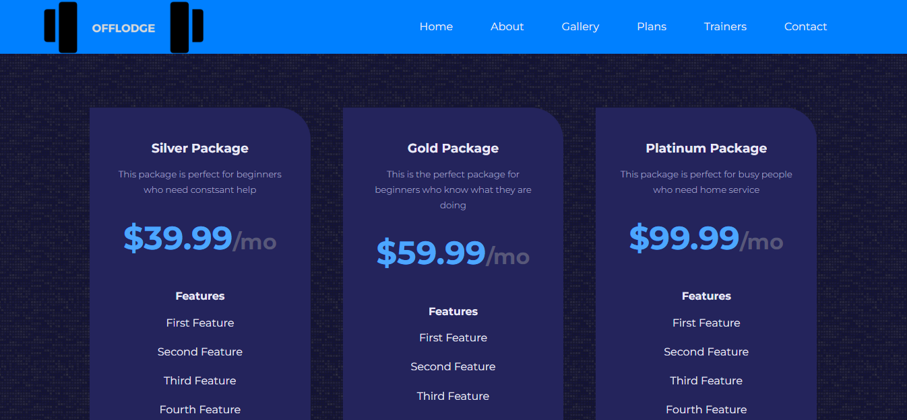
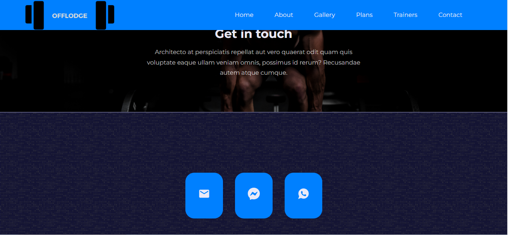

# OFFLODGE

> This is gym house web app to showcase the offlodge gym facilities, instructors and also for customers to join using the plans of there choice.

## Live Version

[Live Demo](https://offlodge.netlify.app/)

## Built With

- Javascript
- React.js
## Getting Started

To get a local copy up and running follow these simple example steps.

### Prerequisites

To run the project on your local machine you need to have:

- bash cli.
- npm.

### Setup

Go to the terminal and type:

- `git clone https://github.com/chukwuemeka1234/offlodge.git [YOUR_PROJECT_NAME]`
- `cd [YOUR_PROJECT_NAME]`
- `npm install`

### Usage

To start a local server on port 3000 run:

- `npm start`
 
  ## Authors
👤 **Victor Chukwuemeka**

- GitHub: [@githubhandle](https://github.com/chukwuemeka1234/)
- Twitter: [@twitterhandle](https://twitter.com/@avc_victor)
- LinkedIn: [LinkedIn](https://www.linkedin.com/in/vic-chukwuemeka/)

## Credits

- The original design idea by [ Egator](https://patreon.com/egator)

## 🤝 Contributing

Contributions, issues, and feature requests are welcome!

## Show your support

Give a ⭐️ if you like this project!
## 📝 License

This project is [MIT](./LICENSE.md) licensed.